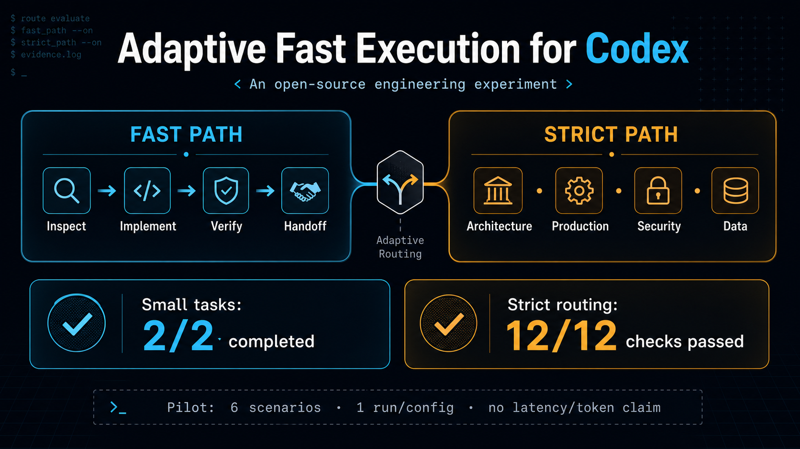

# Adaptive Fast Execution for Codex

一套让 Codex 在小型、低风险代码任务上减少仪式，同时对复杂和高风险任务保持严格流程的实验性 Skill 组合。



```text
局部 + 可逆 + 低风险 + 预计一小时内
    -> 最少检查 -> 直接实现 -> 针对性验证 -> 简短交付

长期 / 跨系统 / 架构 / 生产 / 安全 / 数据 / 计费 / 发布
    -> 严格设计与验证流程
```

## Pilot 结果

- 快速任务完成率：新版 `2/2`，旧强制设计基线 `0/2`。
- 严格场景断言：新版 `12/12`，旧基线 `10/12`。
- 全部断言：新版 `20/20`，旧基线 `12/20`。

这不是速度或 token 节省的最终结论：当前 pilot 每配置只运行一次，且没有可靠的原生耗时/token 遥测。完整方法、证据和限制见 [试验报告](reports/adaptive-fast-execution-benchmark.md)。

## 文件

- `skills/adaptive-fast-execution/SKILL.md`：快速路径选择与执行规则。
- `skills/brainstorming/SKILL.md`：只对 consequential work 启用的设计门槛。
- `skills/adaptive-fast-execution/evals/`：评测与夹具。
- `adaptive-fast-execution-workspace/`：两轮运行和独立评分证据。
- `templates/`：无需平台 API 的 X、小红书发布模板与可复制示例。

## 使用

将两个 Skill 目录复制到个人 Codex Skills 目录并保留目录名，随后重新启动或刷新 Codex。可用“直接实现这个局部修复并运行相关测试”测试快速路径。生产、权限、安全、删除、迁移、计费、公开发布或跨系统变更会自动退出快速路径。
